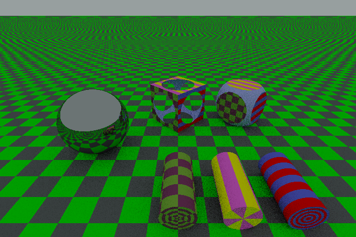

# RayTracer

RayTracer is a C# command-line tool that has two main functionalities:
- converting a PFM (Portable Float Map) file to an LDR (Low Dynamic Range) image file in various formats, with the possibility to specify the normalization factor and the gamma correction used for the conversion 
- rendering a scene defined by an input file with various options such as the rendering algorithm (on-off, flat, path-tracing) and the resolution of the resulting image; the output is a PFM file that is automatically converted to a LDR image with the options listed before.

The project is developed using .NET 9.

## Prerequisites
- Linux or Windows

## Usage
Download the executable corresponding to your OS.
RayTracer is executed from the command line.

To run the tool on Windows:
```sh
.\RayTracer
```
To run the tool on Linux:
```sh
./RayTracer
```
This will show all arguments that have to be specified from command line.

### Parameters:
Use the option -h to show all available commands and options.

### Pfm to Ldr converter:
Example:
```sh
./RayTracer pfm2ldr input.pfm output.png -f 1.2 -g 2.2
```
This command converts `input.pfm` to `output.png` using an exposure scaling factor of `1.2` and gamma correction of `2.2`.

### Renderer:
The scene must be described in the input file, which has to contain the camera and all the shapes that compose the scene. 
The camera represents the observer of the scene and it can be either perspective or orthogonal depending on which type of projection on the screen the user desires. Shapes can be made up of different materials, which must also be defined in the input file. For further details see [Scene Generation Language Tutorial](Scene_Tutorial). Numerical variables declared in the input file can be overridden from command line options.

#### Available rendering algorithms:
- On-off renderer: all the objects are colored uniformly in white against a black backgound
- Flat renderer: all objects are colored according to their material against a black background
- Path tracer: real lighting is simulated by a backward path tracing algorithm

#### Relevant options:
- Image resolution
- Algorithm used for rendering
- Number of rays scattered at each iteration by the path tracer
- Maximum depth of rays
- Maximum depth before Russian Roulette starts occurring in the path tracer
- List of names and list of new values of variables to be overridden

Example:
```sh
./RayTracer render demo.txt -W 1080 -H 720 -p demo.pfm -l demo.png -A path-tracer -e angle -v 30
```
This command renders a demo scene defined in [demo.txt](ExampleScenes/demo.txt) creating a pfm file `demo.pfm` and automatically converting it into a ldr file [`demo.png`](ExampleImages/demo.png), which is shown in the gallery. The resulting image has resolution 1080x720 pixels; the scene is rendered using a using a path tracing algorithm. The value of the scene variable `angle` is overwritten with the new value `30`.
For this command to work the file "demo.txt" must be in the same directory of the executable or otherwise the parameter "demo.txt" must be replaced with its absolute path.

## Gallery
<p align="center">
  
  
</p>

<p align="center">
  <em>Rendering of demo.txt</em> &nbsp;&nbsp;&nbsp;&nbsp;
  <em>Rendering of demo.txt with an orthogonal camera</em>
</p>

<p align="center">
  
</p>

<p align="center">
  <em>Example of texture materials</em>
</p>


## Supported Output Formats
RayTracer supports the following LDR image formats:
- PNG (`.png`)
- BMP (`.bmp`)
- JPEG (`.jpeg`)
- TGA (`.tga`)
- WebP (`.webp`)

## License
This project is licensed under the EUPL-1.2 License.

## Authors
Developed by [giorgiaiori](https://github.com/giorgiaiori) and [Cr3sp1](giorgiaiori).

